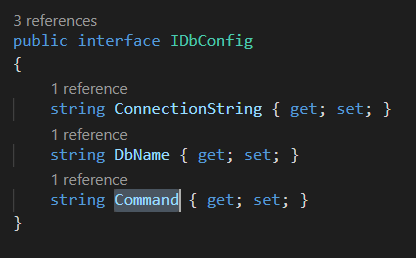
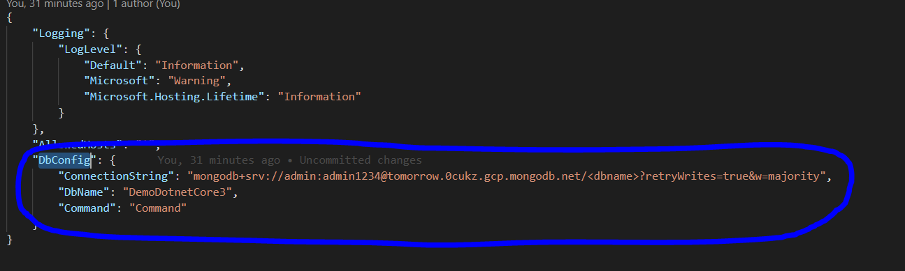
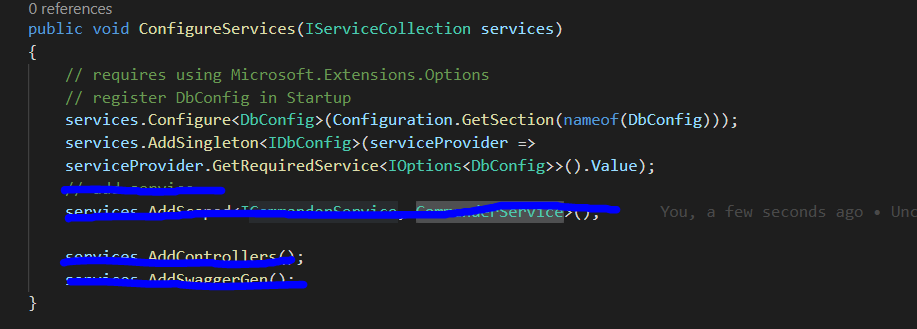
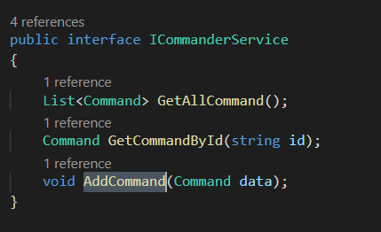
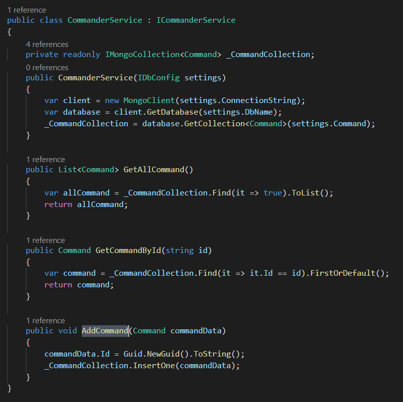
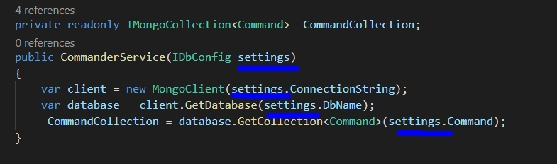
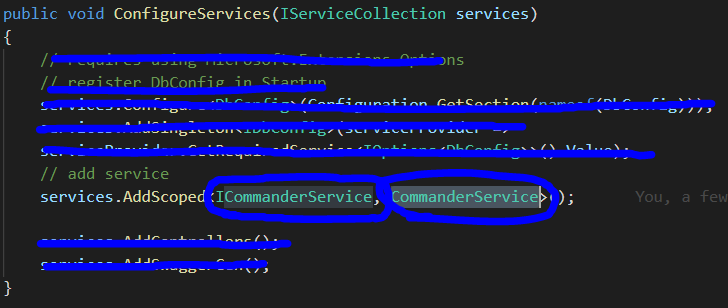
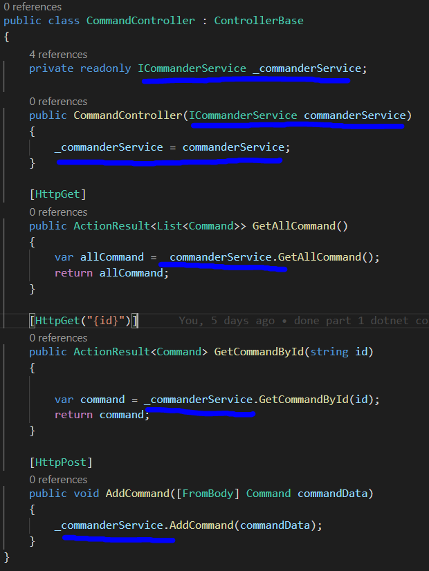

# Dotnet Core 3

## Architecture
> `1.` Program.cs -> เป็น entry point ของ dotnet application เมื่อ run dotnet application มันจะเข้ามาที่นี่เป็นที่แรก ทำงานใน method main เรียกใช้ CreateHostBuilder -> Stratup.cs
>
>

>`2.` Startup.cs -> เป็นส่วน core ศูนย์กลางในการทำงานของ dotnet application เอาไว้สำหรับ set config ต่างๆเกี่ยวกับการเชื่อมต่อพวก service , Http request
>
>

>`3.` .csproj -> เป็นส่วนที่เอาไว้บอกว่า project เรามีการใช้ package , nuget , library ตัวไหนบ้าง รวมถึงบอก version ของ dotnet core 
>
>

>`4.` appsettings.json -> เป็นส่วนที่เอาไว้เพิ่ม additional config หรือ connetion string
>
>

## REST & RESTFUL API
> `REST (Representational State Transfer)` -> เป็นรูปแบบของ software architecture ที่ใช้ web protocol(HTTP) ในการสร้าง web service

>`RESTFUL API (RESTFUL)` -> Web Service ที่ใช้ REST ในการสร้าง(ใช้ HTTP GET,POST,PUT,DELETE ในการ request และ response กลับมาในรูปแบบของ JSON หรือ XML ระหว่าง client กับ server)

## Controller

> 
> `1.` Route กับ ApiController เป็น decoration ที่เอาไว้บอกคุณสมบัติของ class โดย
> * `Route` -> เอาไว้กำหนด endpoint url ที่จะใช้ call เข้ามาเมื่อต้องการใช้ controller
> * `Apicontroller` -> เอาไว้บอกว่า class นี้เป็น controller ที่จัดการเกี่ยวกับ api
>
> `2.` HttpGet , HttpPost , HttpPut , HttpDelete เป็น decoration ที่บอกว่า method นี้เป็น Http request แบบไหน เพื่อให้เข้าใจว่ามันใช้งานแบบไหน
> * `HttpGet` -> ใช้ request เพื่อ get data
> * `HttpPost` -> ใช้ request เพื่อส่ง data ไปให้ server
> * `HttpPut` -> ใช้ request เพื่อต้องการจะแก้ไขเปลี่ยนแปลง data
> * `HttpDelete` -> ใช้ request เพื่อต้องการจะลบ data
>
>`**Note : ` สามารถส่ง Parameter ได้ 2 แบบ
> * `route parameter` ->  ถ้าต้องการส่งแบบนี้ จะต้องมีการกำหนด parameter ให้กับ decoration Http ด้วย เช่น `[HttpGet("{id}")]` \
> ลักษณะของ endpoint => host/getId/`id`
> * `query string` -> ถ้าจะส่งแบบนี้ ไม่ต้องกำหนด parameter ให้กับ decoration Http \
> ลักษณะของ endpoint => host/getId/`?id=123`
>
> `3.` HttpPost => ส่ง data ผ่าน Http request พร้อม request body จะต้องส่งผ่าน attribute `[FromBody]` ซึง server จะ get value จาก request body ที่ส่งเข้ามาผ่าน attribute `[FromBody]`

## Dependency Injection Service
> สามารถ register service ได้ 3 วิธี (register ใน method `ConfigureServices` ใน `Startup.cs`)
> * `AddSingleton` -> ทุกๆ request จะต้อง get object เดิม
> * `AddScoped` -> ทุกๆ client request จะต้องสร้าง object ใหม่
> * `Transient` -> จะต้องสร้าง instance ใหม่ตลอดเวลาเมื่อถูก request

## Step Config service and use in controller
> `1.` สร้าง interface และ class ของ Database config
>
> 
> 
>
> `2.` เพิ่ม config ของ DbConfig เข้าไปใน appsetting.json
>
> 
>
> `3.` register DbConfig ใน Startup.cs
>
> 
>
> `4.` สร้าง interface และ class ของ service 
>
> 
> 
> 
> `5.` dependency injection dbConfig ให้กับ service เพื่อดึง dbConfig ที่ตั้งค่าไว้มาใช้
>
> 
>
> `6.` register interface และ class ของ service ที่ Startup.cs
>
>
>
> `7.` dependency injection service ไปใช้ที่ controller
>
> 
>
> `หมายเหตุ:` การ register Dbconfig และ service ไปที่ ConfigureServices ใน Startup.cs เพื่อให้ทั้ง app รู้จักและสามารถเรียกใช้ได้
